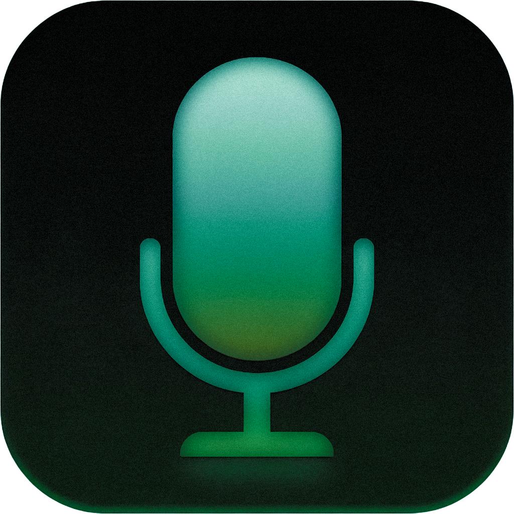

#  dybur

Fast, local, private voice dictation for macOS and Windows.

> Talk into any text field. Instantly. Without cloud, accounts, or privacy trade-offs.
> [dybur.com](https://dybur.com)

## Features

- **100% Local** - Speech recognition runs entirely on your device using state-of-the-art ONNX models
- **Universal** - Inject text into any application via hotkey
- **Private** - No cloud, no accounts, no telemetry
- **Fast** - Sub-second transcription latency
- **Multilingual** - Supports 25 European languages with automatic detection
- **Smart** - Automatic punctuation and capitalization
- **VAD** - Voice Activity Detection filters silence for better accuracy

## Installation

Download the latest release from [GitHub Releases](https://github.com/oshtz/dybur/releases).

## Usage

1. Launch the app (or run `dybur start` from CLI)
2. Focus any text field
3. Press `Ctrl+Shift+Space` (default hotkey)
4. Speak
5. Press the hotkey again to stop (or release if using push-to-talk mode)
6. Text appears in the active field

### Recording Modes

dybur supports two recording modes:

- **Toggle** (default): Press the hotkey to start recording, press again to stop
- **Push-to-Talk**: Hold the hotkey to record, release to stop and transcribe

You can switch modes from the tray menu (Recording Mode) or by editing the config file.

### Voice Activity Detection (VAD)

VAD automatically filters silence and background noise before transcription, improving accuracy and reducing processing time. It uses the lightweight [Silero VAD](https://github.com/snakers4/silero-vad) model (~2MB) running locally via ONNX.

VAD is enabled by default. Toggle it from the tray menu or via CLI:

```sh
dybur vad          # Toggle VAD on/off
dybur vad on       # Enable VAD
dybur vad off      # Disable VAD
dybur vad status   # Show VAD settings
dybur vad threshold 0.6   # Set speech sensitivity (0.0-1.0)
dybur vad min-speech 250  # Set minimum speech duration in ms
dybur vad silence 1000    # Set silence split timeout in ms
```

All settings and controls are available from the tray menu or via CLI:

```sh
dybur start       # Start background service
dybur stop        # Stop service
dybur status      # Check service health (alias: s)
dybur settings    # Open config file (alias: config)
dybur doctor      # Run diagnostics (alias: diag)
dybur models      # Manage speech models (alias: m)
dybur devices     # Manage input devices (alias: d)
dybur vad         # Toggle Voice Activity Detection
```

## Configuration

Config file location:

- **macOS:** `~/Library/Application Support/dybur/config.json`
- **Windows:** `%APPDATA%\dybur\config.json`

```json
{
  "hotkey": "Ctrl+Shift+Space",
  "autoPunctuation": true,
  "sentenceCase": true,
  "silenceTimeoutMs": 1000,
  "model": "parakeet-tdt-v3-int8",
  "clipboardCleanup": true,
  "inputDevice": null,
  "recordingMode": "toggle",
  "vadEnabled": true,
  "vadThreshold": 0.5,
  "vadMinSpeechMs": 250,
  "gpuMode": "auto",
  "streamingEnabled": true
}
```

| Option             | Values                      | Description                                                     |
| ------------------ | --------------------------- | --------------------------------------------------------------- |
| `hotkey`           | Key combo                   | Global hotkey to trigger recording                              |
| `autoPunctuation`  | `true`/`false`              | Automatically add punctuation                                   |
| `sentenceCase`     | `true`/`false`              | Capitalize first letter of sentences                            |
| `silenceTimeoutMs` | Number                      | Minimum silence duration used to split VAD speech segments (ms) |
| `model`            | Model name                  | Speech recognition model to use                                 |
| `clipboardCleanup` | `true`/`false`              | Restore clipboard after text injection                          |
| `inputDevice`      | Device name or `null`       | Microphone to use; `null` uses the system default               |
| `recordingMode`    | `"toggle"`/`"push_to_talk"` | Recording behavior mode                                         |
| `vadEnabled`       | `true`/`false`              | Enable Voice Activity Detection                                 |
| `vadThreshold`     | `0.0`-`1.0`                 | VAD sensitivity (higher = stricter)                             |
| `vadMinSpeechMs`   | Number                      | Minimum speech duration to keep (ms)                            |
| `gpuMode`          | `"auto"`/`"cpu"`            | Use GPU acceleration when available or force CPU                |
| `streamingEnabled` | `true`/`false`              | Enable live preview for compatible streaming models             |

## Models

dybur supports multiple speech recognition models. You can switch models from the tray menu or via CLI:

```sh
dybur models list      # List available models
dybur models set       # Select a model interactively
dybur models candidates # Show experimental model candidates
```

| Model                         | Size    | Languages | Description                                             |
| ----------------------------- | ------- | --------- | ------------------------------------------------------- |
| `parakeet-tdt-v3-int8`        | ~670 MB | 25        | **Default.** Multilingual transducer, balanced accuracy |
| `parakeet-tdt-v2-int8`        | ~660 MB | English   | Fast English-only transducer                            |
| `nemotron-streaming-int8`     | ~660 MB | English   | Low-latency streaming transducer                        |
| `whisper-large-v3-turbo-int8` | ~1.1 GB | 99        | OpenAI Whisper, broad language support                  |
| `whisper-large-v3-turbo-fp16` | ~1.6 GB | 99        | Whisper FP16, higher accuracy                           |

Models are downloaded automatically on first use.

### Manual Model Provisioning

For offline or locked-down machines, pre-provision models from a connected machine:

1. On the connected machine, run `dybur models download <model-id>`.
2. Copy the downloaded model directory into the target machine's models directory:
   - macOS: `~/Library/Application Support/dybur/models/<model-id>`
   - Windows: `%APPDATA%\dybur\models\<model-id>`
3. If VAD is enabled, also copy `silero-vad` from the same `models` directory.
4. On the target machine, run `dybur models set <model-id>` and `dybur doctor`.

Keep the copied `metadata.json` file with each model directory; dybur uses it for status and cleanup.

### ASR Evaluation

Use the local scoring harness to compare saved model hypotheses across a repeatable sample set:

```sh
pnpm eval:asr:manifest benchmarks/asr/example.json --require-duration --require-tags
pnpm eval:asr:manifest benchmarks/asr/<run>.json --config benchmarks/asr/corpus-policy.example.json
pnpm eval:asr benchmarks/asr/example.json
pnpm eval:asr benchmarks/asr/example.json --format json --output benchmarks/asr/report.json --strict
pnpm eval:asr:gate benchmarks/asr/candidate-report.json --config benchmarks/asr/gates/candidate-promotion.example.json
```

The harness reports WER, CER, median latency, realtime factor, and per-tag summaries. See `docs/asr-evaluation.md` for the manifest shape, reusable corpus policy, and recommended sample set.

Experimental model candidates such as CoreML Parakeet, MLX Parakeet, Qwen3-ASR, and Moonshine are tracked separately from production model IDs. Use `dybur models candidates` to inspect them, `scripts/asr-candidates/` for benchmark wrappers, and `docs/model-candidate-evaluation.md` for the benchmark workflow.

### Release Verification

Before publishing or checking the landing page against a new app release, verify the GitHub release contract:

```sh
pnpm release:verify
pnpm release:verify:macos
pnpm release:verify:windows
```

The verifier checks that the latest GitHub release tag matches `package.json`, that the stable public assets are present (`dybur-macos-arm64.dmg` and `dybur-windows-x64.exe`), that known legacy asset names are absent, and that `/latest/download/` URLs resolve.

`pnpm release:verify:macos` downloads the public DMG, records SHA-256 and file size, and reports that deeper mount/codesign/Gatekeeper checks require macOS. On a Mac, run `node scripts/verify-macos-release.js --require-macos-checks` to make those checks mandatory. For CI fixtures or locally downloaded artifacts, run `node scripts/verify-macos-release.js --input-file path/to/dybur-macos-arm64.dmg --skip-macos-checks --expected-sha256 <hash>`.

On Windows, `pnpm release:verify:windows` also downloads the public portable EXE, records SHA-256 and file size, and reports Authenticode status. Add `-RequireSignature` when running `scripts/verify-windows-release.ps1` directly if signature validity should be a hard release gate. For locally built artifacts, run `powershell -NoProfile -ExecutionPolicy Bypass -File scripts/verify-windows-release.ps1 -InputFile path/to/dybur-windows-x64.exe -RequireSignature`.

The Windows release workflow signs the final portable EXE when these GitHub secrets are present:

- `WINDOWS_CERTIFICATE`: base64-encoded PFX code-signing certificate.
- `WINDOWS_CERTIFICATE_PASSWORD`: PFX password.
- `WINDOWS_TIMESTAMP_URL`: optional timestamp server; defaults to `http://timestamp.digicert.com`.

When the certificate secrets are configured, CI runs the Windows verifier with `-RequireSignature` before upload. Without those secrets, the release remains unsigned and the verifier reports Authenticode status as a warning.

Use [docs/release-smoke-checklist.md](docs/release-smoke-checklist.md) for the manual macOS, Windows, landing page, and ASR candidate smoke checks that cannot be fully proven from a non-interactive CI run.

## Requirements

- **macOS:** 10.15+ (Catalina or later)
- **Windows:** 10/11
- **Microphone:** Required for dictation
- **Disk:** ~700 MB - 1.6 GB depending on speech model

### macOS Permissions

On first launch, macOS will prompt for the following:

- **Administrator Password** - To install the `dybur` CLI command to `/usr/local/bin` (one-time setup, can be skipped)
- **Microphone Access** - Required for voice recording during dictation
- **Accessibility** - Required for injecting text into applications (System Settings → Privacy & Security → Accessibility)

## Development

### Prerequisites

- Node.js >= 18.0.0
- pnpm 8.10.0+
- Rust (for building the tray application)

### Project Structure

```
dybur/
├── apps/
│   ├── cli/               # Rust CLI binary (sidecar for tray app)
│   └── tray/              # Tauri 2.0 tray application
├── packages/
│   ├── cli/               # Node.js CLI (@dybur/cli)
│   ├── config/            # Configuration management
│   └── core/              # Core business logic
└── scripts/               # Build and utility scripts
```

### Setup

```sh
# Install dependencies
pnpm install

# Build all packages
pnpm build

# Run tests
pnpm test

# Lint code
pnpm lint

# Type check
pnpm typecheck
```

### Building the Tray App

```sh
cd apps/tray
pnpm tauri build
```

## Privacy

- All speech processing happens locally on your device
- Audio never leaves your computer
- No cloud services, no accounts required
- No telemetry or analytics
- Logs contain no speech content

## License

MIT
